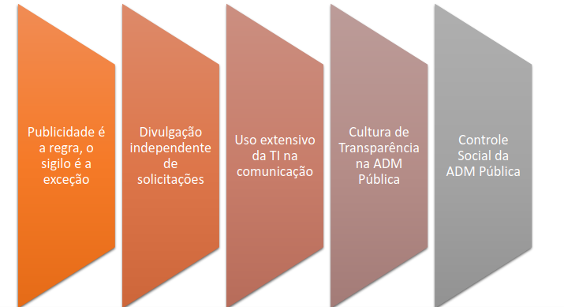
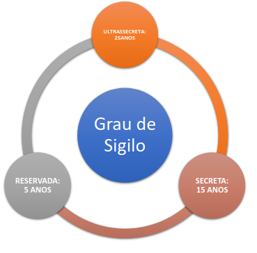

# Lei de acesso à informação (LAI)

Lei que abrange todas as **esferas do poder** (legislativo, executivo e judiciário), além de **todas as esferas de governo**.

Dentre suas principais características são:

- **o acesso é a regra, o sigilo é exceção**(divulgação máxima).
- **requerente não precisa dizer porque e para que deseja utilizar a informação**(não exigência de motivação).
- **hipótese de sigilo são limitadas e legalmente estabelecidas**(limitação de exceções).
- **fornecimento gratuito de informação, salvo custo de reprodução**(gratuidade da informação).
- **divulgação proativa de informações de interesse coletivo e geral**(transparência ativa).
- **criação de procedimentos e prazos que facilitem o acesso à informação**(transparência passiva).

## Exceções

Detre algumas exceções estão:

- **dados pessoais**: dados que identificam pessoas, por natureza, já são classificados como sigilosos.
- **informações classificadas como sigilosas**: exigem um processo para verificação se um dado é ou não sigiloso.
- **informações sigilosas com base em outras leis**: baseados em outras leis e normas.

## capítulo 1 - 1 ao 5 -> Diretrizes

Algumas diretrizes dessa lei:

## capítulo 2 - 6 ao 9 -> Acesso e divulgação

**órgãos** devem assegurar:

- o **acesso** e a **divulgação** das informações.
- **proteção da informação**: disponibilidade, autenticidade e integridade.
- **proteção da informação sigilosa e pessoal**: disponibilidade, autenticidade, integridade e restrição.

**Não há a obrigatoriedade de divulgação para municípios com menos de 10 mil habitantes**

Algumas dessas **informações** podem ser:

- registros e documentos;
- atividades exercidas pelos órgãos;
- administração do patrimônio e recursos públicos;
- programas, projetos, e ações, metas e indicadores;
- resultados de inspeções, auditorias, prestações e tomadas de contas;

Também os órgãos devem ter o **serviço de informação ao cidadão** para trabalhar com a parte da informação, também realizar **audiências públicas** para obter a opinião da sociedade.

## capítulo 3 - 10 ao 14 -> Do pedido de acesso

**Qualquer pessoa pode pedir informações públicas**, independente de pessoa **física** ou **jurídica**, quanto **idade** ou **nacionalidade**.
Apenas o pedido deve conter: **identificação do solicitante** e **especificação da informação**.
A **resposta** deve ser **imediata**, contudo, o prazo máximo de 20(podendo prorrogar por mais 10) **dias** para:

- indicar ou providenciar a cópia ou certidão;
- dizer os motivos de negação total ou parcial;
- comunicar que não possui a informação;

O serviço para a busca e fornecimento de informação é **gratuito**, podendo ser**cobrado o custo de reprodução**.

Os **recursos** devem ser dirigidos à autoridade **hierarquicamente superior(poder executivo federal -CGU)**.

- **prazo para interpor**: 10 dias da ciência da negação;
- **prazo para resposta pelo órgão**: até 5 dias;

## capítulo 4 - 21 ao 31 -> Das restrições de acesso à informação

### disposições gerais

Informações que **não podem** ser sigilosas:

- tutela judicial ou administrativa de direitos fundamentais;
- conduta que impliquem **violação dos direitos humanos** pratica por agentes públicos.

Informações que **podem** ser sigilosas, são aquelas que **prejudicam/põem em risco** :

- **defesa e soberania nacional**;
- **vida, segurança e saúde** da população;
- estabilidade **financeira, econômica ou monetária** do país;
- planos ou operações estratégicas das **forças armadas**;
- segurança de instituições ou altas **autoridades nacionais ou estrangeiras**;
- **atividades de inteligência** sobre prevenção e repressão de infrações;

A **classificação quanto ao grau e prazo**:

A classificação usa critérios **menos restritivos considerando**:

- gravidade do risco ou dano à segurança;
- prazo máximo de restrição de acesso ou evento que defina seu termo final;

Informações de risco à segurança de **presidente e vice** = **reservadas**;

### proteção e do controle de informações sigilosas

**O estado deve controlar o acesso e proteger as informações sigilosas**

Somente **pessoas devidamente credenciadas** podem acessar e tratar informações sigilosas, as autoridades públicas devem ter as **normas de proteção**.

#### quem classifica

- ultrasecreto: PR, VPR, ministros de estados, comandantes das forças armadas, chefe de missões diplomáticas;
- secreto: anteriores e titulares de Adm indireta;
- reservado: funções comissionadas e cargos de direção e chefia;

Podem ser **delegadas** mas **não subdelegadas**

#### como deve ser classificada

- deve ser formalizada em **decisão específica**;
- poderá ser **reavaliada** mediante **provocação**(pedido da sociedade) ou **ofício** a cada **4 anos**;
- deve ser **divulgado as informações de classificação e desclassificação** por meio da internet;

#### informações pessoais

- relativas à intimidade, vida privada, honra e imagem;
- acesso **restrito** independentemente de classificação sigilosa;
- prazo **máximo de 100 anos** desde sua produção;
- **exceção**: **previsão legal** ou **consentimento expresso**;

#### das responsabilidades - condutas ilícitas em relação a lei

As condutas ilícitas de acesso e proteção poder ter as seguintes **sanções**:

- advertência, multa, rescisão, suspensão temporária para licitar, declaração de inidoneidade para licitar(conduta fraudulentas);

#### disposições finais e transitórias

Criação da **comissão mista de reavaliação de informações**, com mantado de 2 anos que podem requisitar esclarecimentos sobre classificação ultrassecretas e secretas, além de **rever e prorrogar o seus prazos**;
