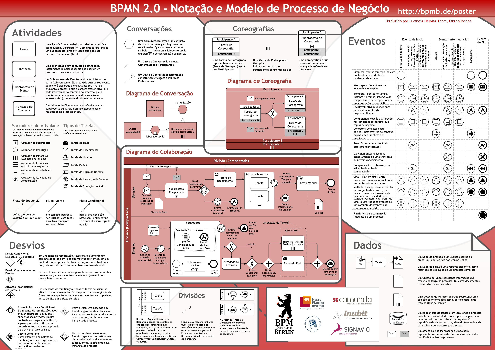

# BPMN

**BPMN (Business Process Model and Notation)** é um padrão criado pela **Business Process Management Initiative (BPMI)** e incorporada ao **Object Management Group (OMG)** estabelecendo padrões para sistemas de informação.

Suas principais características são:

- Ícones organizados em conjuntos descritivos e analíticos para atender a diferentes necessidades de utilização.
- Notação que permite a indicação de eventos de início, intermediário e fim (horizontal), além de fluxo de atividades e mensagens, comunicação e colaboração e com **elementos** de piscinas, raias, e conectores.

**Deve ser usando** para apresentar um modelo de processos para um **público-alvo diferentes**, **simular** um processo de negócio e **gerar aplicações em BPMS**.
**vantagens**: sua **popularidade** entre as organizações, **versatilidade** para modelar as diversas situações de um processo e seu **suporte a ferramentas BPMS**.
**Desvantagens**: exigência de **treinamento e experiência** para o seu uso correto do seu conjunto de símbolos, **dificuldade de visualização** de relacionamento entre níveis de um processo, seu **uso difícil para pessoas de negócio**.

## Tipos de Diagramas BPMN

Existem 3 tipos:

- **Privativo(interno)**: Quando não há interesse em verificar a interação entre esse processo e outro.(não importa interação)
- **Abstrato**: Interação entre o processo principal e outro processo participante,esse não há preocupação com o conteúdo do fluxo, mas sim com a colaboração.(há a interação, mas não é detalhado)
- **Colaborativo**: Interação entre duas ou mais entidades de negócio, sendo que o conteúdo do fluxo é especificado em todas as entidades.(há a interação e é detalhado)

## elementos

### Piscinas e raias

- **Piscina(Pool)**: Representa um processo ou uma entidade.
- **Raia(Lane)**: É uma subpartição dentro da pool. Utilizadas para organizar e categorizar as polls.
- **Etapa(Milestone)**(extensão): É uma subpartição dentro do processo. São usadas para organizar o processo em etapas.

### Conectores

- **Fluxo de Sequência**: Mostra a ordem em que as atividades serão executadas, só possui uma origem e destino.
- **Fluxo de Mensagem**: Mostra o fluxo de mensagens entre dois participantes(dois pools).
- **Associação**(extensão): Associa informações com objetos de fluxo.

### Atividades

- **Tarefas**: A tarefa é ua atividade de trabalho no **menos nível de granularidade**. Ela representa uma **ação no processo** que pode ser executada por uma **pessoa ou sistema**.
  - subdividido em tarefas de: abstrata(sem nada), serviço, recebimento, envio, usuário, execução de script, manual, regra de negócio.
- **subprocessos**: O subprocesso representa a abstração de um conjunto lógico de atividades com um propósito específico. Apresenta o símbolo '[+]' para indicar que a atividade contém um conjunto de tarefas, ou também na forma expandida, demostrando os processos.
  - subdividido em subprocessos de: incorporado, reutilizável, eventual, transacional.

#### Marcadores de Atividades

- **repetição em loop**: uma atividade de loop terá uma expressão booleana avaliada para cada ciclo.
  - Existem dois tipos **WHILE(enquanto) - avalia antes** e o **UNTIL(até) - avalia depois**.
  - Também há o **Loop Multi-instance - (igual o for)** especificando o número de vezes que a atividade será realizada.

### Gateways

há diversos tipos de gateways, dentre eles estão:

- **Exclusivo Baseado em dados**:

  - Divisão: dá o **seguimento ao fluxo** por uma **condição exclusiva**, em que **apenas um dos caminhos será seguido** baseano num **teste(if)**.
  - Unificação: dá o seguimento ao fluxo quando um dos caminhos **atingir o gateway**. Há a **convergência de caminhos** nele.

- **Exclusivo Baseado em eventos**:

  - semelhante ao baseado em dados, com a diferença de ser os **eventos que trarão o gatilho**. Apenas podem seguir **um caminho**.

- **Paralelo**:

  - Divisão: **divisão de um fluxo** em dois ou mais, que serão **executados paralelamente**. Como se fosse o **'e'** (um e outro serão seguidos).
  - Unificação: dá a sequência apenas quando **todos os caminhos forem completados**. Para garantir que **todos os fluxos tenham uma conclusão**.

- **Inclusivo**:
  - semelhante ao paralelo, com a diferença que os caminhos **podem ou não serem seguidos**, dependendo das condições do fluxo. Como se fosse o **e/ou** (um e/ou outro serão seguidos).

### Eventos

subdividido em três tipos:

- **Eventos de início**: inicia um processo. **Sempre do tipo catch**, devendo aguardar a ocorrência de um evento.
  - simples(none): quando o processo foi iniciado e não foi definida a forma de sua iniciação.
  - múltiplo: pode ser iniciado de várias formas distintas, invés de colocar todos os possíveis eventos, apenas se utiliza o múltiplo com o seus possíveis gatilhos.
  - prazo: indica que um processo será inicializado em um determinado tempo, data ou ciclo.
  - mensagem: serve para indicar que o processo tem início com o recebimento de uma mensagem(apenas 1 mensagem é enviada). Deve-se especificar a label, indicando qual a requisição.
  - condicional: serve para indicar que o processo tem início quando uma condicional for atendida.
  - múltiplo paralelo: serve para indicar que o processo tem início quando todos os eventos forem recebidos.
  - sinal: serve para indicar que o processo tem início quando um sinal é recebido, um sinal pode ser recebido por vários pontos de vários processos.
- **Eventos intermediário**: acontece durante o processo. Podem ser do tipo **catch**(aguardando a ocorrência do fato) ou **throw**(geram a ocorrência de um fato). Ele é sinalizado com conectores.
  -tempo: eventos de tempo, tanto de prazo, quanto de espera, podem ser borda de evento.
- **Eventos de fim**: finaliza um processo. **Sempre do tipo throw**, marcando que o processo termina com a geração de um fato. Pode ser usado mais de um.
  - término: o processo é finalizado por completo, mesmo que haja fluxos paralelos acontecendo.

além desses há a combinação de outros símbolos para criar **eventos complexos**:

- **Mensagem**: mensagem pode chegar de um gatilho ou participante(início), continuando no processo e pode-se gerar uma mensagem de fim.
- **Temporizador** : mostra o tempo para iniciar um ciclo ou continuar. **Não pode ser evento de fim**.
- **Regra** : iniciado quando a condição da regra for verdadeira, ou continuar enquanto verdadeiro. **Não pode ser evento de fim**.
- **Ligação** : usado para conectar atividades de um mesmo processo, para tornar o diagrama mais limpo. **Não pode ser evento de início e fim**.
- **Múltiplo** : existem múltiplas formas de desencadear o processo(início) continuar ou consequências(fim) na finalização do processo, o atributo do evento define o gatilho.
- **Exceção** : informa ao processo que um erro deverá ser criado(intermediário).**Não pode ser início e, no fim só pode ser usado em borda de uma atividade**.
- **Compensação** : informa ao processo que uma compensação deverá ser criado(intermediário), principalmente utilizado quando o processo está sofrendo um **roll back** . **Não pode ser início**.
- **Cancelamento** : indica que o usuário decidiu cancelar o processo, ele é finalizado com um tratamento de evento normal.**Não pode ser início**.
- **Terminal** : indica que todas as atividades dentro do processo deverão ser imediatamente finalizadas, sem o tratamento de evento.**Não pode ser início e intermediário**.
- **Sinal** : um sinal é gerado para comunicação dentro ou por meio de níveis de processos, pools e diagramas.

### Artefatos

São **elementos de anotações**, que podem ser utilizados para adicionar informações complementares ao processo.

São os seguintes elementos:

- **objeto de dados**(data object): representa um **conjunto de informações** no contexto do processo, **atividade** ou **troca de mãos**.
- **anotação de texto**(annotation): representa um **comentário ao processo ou elemento**.
- **grupo**(group): representa um **grupos de atividade com algum destaque**, é uma simples anotação e não influencia no fluxo do processo.
- **conector de associação**(association): representa uma **ligação entre os elementos de artefatos ao diagrama**.(linha pontilhada)

